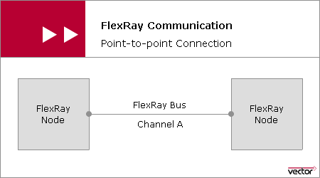
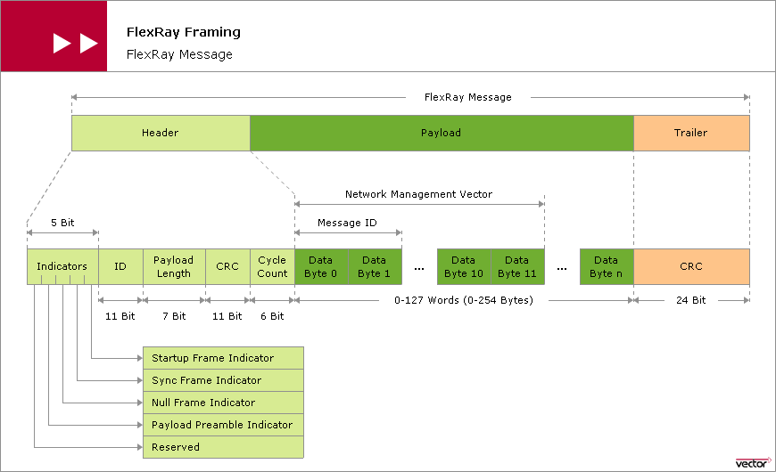
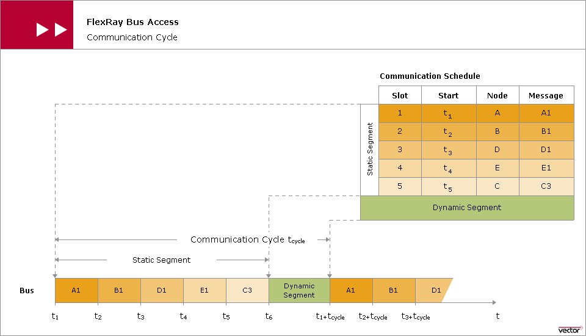

# FlexRay
[vector](https://elearning.vector.com/vl_flexray_introduction_en.html)

## Motivation for FlexRay

Why no tuse CAN? This bus (CAN)

- CAN cannot guarantee deterministic times
- CAN cannot fulfill the needed fault tolerance

CAN is an event driven communication, which means that every bus node of a communication
system must be able to access the common communication medium at any time. Then the nodes
need to solve the collisions this leads to a communication flow that cannot be determined
until runtime.

Event-driven communication systems enable quick reaction to asynchronous processes, but
not in a deterministic way.

As adding and removing nodes from the network will affect the bus behavior. Strictly
speaking, such changes make necessary to revalidate the entire system. Event-driven
communication systems do NOT exhibit the property of composability.

## FlexRay Communication

### Communication Architecture
FlexRay provides a redundant layout communication channel. Each of the two communication
channels may be operated at data rate of up to 10 Mbit/s. However, as an alternative this
redundant channel may be used to increase the data rate to 20 Mb/s. This change can be
made for each message.

FlexRay uses a time-triggered communication architecture. The principle of time control
not only enables deterministic data communication, but also simple composability.

To implement the time-triggered control the Time Division Multiple Access is used (TDMA)
This means that the FlexRay nodes may not access the bus in an uncontrolled manner in
response to application-related events as in CAN. FR nodes must conform to a precicely
defined communication schedule, which assigns a specific time slot to each FR message.

### Active and passive topologies

The Electrical Physical Specification prescribes that for any type of network (passive/active)
the length may not exceed 24m.

The differences between a passive and an active are:
- Passive does not contain active couplers, ie, connections are made by bare cables.
-

#### Passive topologies:

| P2P | Passive Star | Line topology with redundancy
| :------------- | :------------- | :------------- |
|        |        |  |

#### Active topologies:

| Active star | Active star + redundancy | cascaded active star |
| :------------- | :------------- | :------------- |
|        |        |  |

an active coupler accepts signals via communication branch, amplifies them and
distributes them to all other communication branches.

The active star also has the advantage of avoid error propagation by disconecting
faulty communication branches from the active star coupler.

During the design process for an active cluster topology, it must be considered that
__the active star coupler delay the transmission__.

### Framing
#### Frame header

The data transmission is executed usign uniform message frame.
Each FR message is composed of three parts:
- Header (40 bits)
  - Indicator bits: 5 bits
    - Reserved:
    - Payload preamble
    - Null frame Indicator
    - Payload preamble indicator
      - indicates if a NM vector is being transmitted in the payload.
    - Reserved
  - ID: 11 bits
  - cycle count
    - counts the number of the cycle in which the message is sent. (Up to 63)

#### Frame payload
The payload has a max size of 254 bytes per message. The header parameter payload length shows the size
in `words`.

The payload has the same value for all the messages transmitted in the static segment.

Since the dynamic messages are not restricted to fixed payload size, it may assume
different values for such messages.

In a message transmitted in the static segment it's possible to send NM messages,
for this the indicator payload preamble indicator must be set.

If the payload preamble indicator is set for a dynamic FlexRay message, this indicates
that the payload begins with a network management vector. In a dynamic message,
this indicates that the first two bytes are the message identifier. The message
identifier gives the system designer a way to specify the payload more precisely;
it may be used as a basis for making finer distinctions in acceptance filtering.

#### Coding

TODO

- - -
A communication cycle consists of a static segment, an optional dynamic segment,
an optional symbol window and a network idle time.

A communication slot is an interval of time during which access to a communication
channel is granted exclusively to a specific node for the Tx of a frame with a frame
ID corresponding to the slot.

Dynamic segment: Portion of the communication cycle wher the media access is controlled
via mini-slotting scheme, also known as flexible time division multiple acecss (FTDMA).
During this segment access to the media is dynamically granted on a priority basis to
nodes with data to transmit.

- - -
Definitions:

* Coldstart node:
Node capable of initiating the communication start-up procedure on the cluster by sending
start-up frames.
