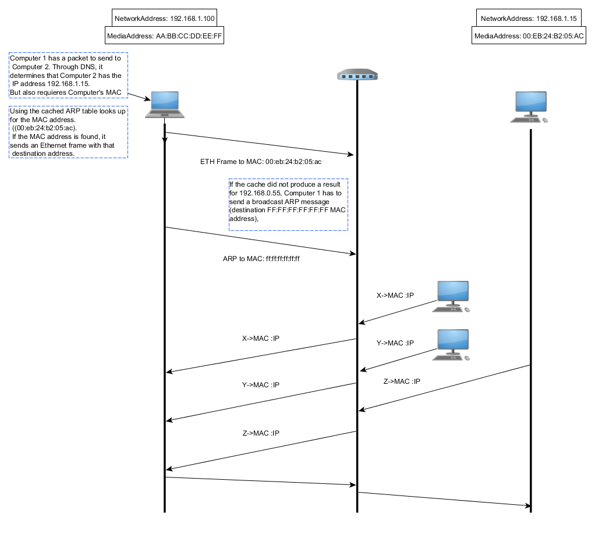

# Address Resolution Protocol (ARP)

**Communicates mappings from <Protocol, address>**

In the case of IPv4 ARP maps network addresses to a physical address.
Translate layer 3 and layer 2 addresses.

In IPv6 the functionality of ARP is provided by the Neighborg Discovery Protocol.

### ARP protocol layout

<table style="float:right; background-color: #08090a; text-align: center; width: 30em;" border="1">
<tbody><tr>
<th colspan="17">Internet Protocol (IPv4) over Ethernet ARP packet</th>
</tr>
<tr>
<th colspan="1">octet offset</th>
<th colspan="8" width="50%">0</th>
<th colspan="8" width="50%">1</th>
</tr>
<tr>
<th>0</th>
<td colspan="16">Hardware type (HTYPE)</td>
</tr>
<tr>
<th>2</th>
<td colspan="16">Protocol type (PTYPE)</td>
</tr>
<tr>
<th>4</th>
<td colspan="8">Hardware address length (HLEN)</td>
<td colspan="8">Protocol address length (PLEN)</td>
</tr>
<tr>
<th>6</th>
<td colspan="16">Operation (OPER)</td>
</tr>
<tr>
<th>8</th>
<td colspan="16" style="background:#d0400f">Sender hardware address (SHA) (first 2 bytes)</td>
</tr>
<tr>
<th>10</th>
<td colspan="16" style="background:#d0400f">(next 2 bytes)</td>
</tr>
<tr>
<th>12</th>
<td colspan="16" style="background:#d0400f">(last 2 bytes)</td>
</tr>
<tr>
<th>14</th>
<td colspan="16" style="background:#d01fd0">Sender protocol address (SPA) (first 2 bytes)</td>
</tr>
<tr>
<th>16</th>
<td colspan="16" style="background:#d01fd0">(last 2 bytes)</td>
</tr>
<tr>
<th>18</th>
<td colspan="16" style="background:#c0000f">Target hardware address (THA) (first 2 bytes)</td>
</tr>
<tr>
<th>20</th>
<td colspan="16" style="background:#c0000f">(next 2 bytes)</td>
</tr>
<tr>
<th>22</th>
<td colspan="16" style="background:#c0000f">(last 2 bytes)</td>
</tr>
<tr>
<th>24</th>
<td colspan="16" style="background:#10d0ff">Target protocol address (TPA) (first 2 bytes)</td>
</tr>
<tr>
<th>26</th>
<td colspan="16" style="background:#10d0ff">(last 2 bytes)</td>
</tr>
</tbody></table>

#### Hardware type (HTYPE)
Speicfies the network protocol type. For example, ETH is 1.

#### Protocol type (PTYPE)
Specifies the internetwork protocol for which the ARP request is intended. IPv$ is `0x0800`.

#### Hardware length (HLEN)

length in octets of a hardware address. ETH address siye is 6.

#### Protocol length (PLEN)

Length in octets of addresses used in the upper layer protocol. For IPv4 address siye is 4.

#### Operation
Specifies the operation that the sender is performing. 1 for request, 2 for reply.

#### Sender HW address (SHA)

Media address of the sender.
- In a request this field is used to indicate the address
of the host sending the request.
- In a reply this field is used to indicate the address of the host that request was looking for.

#### Sender protocol address (SPA)

Internetwork address of the sender.

#### Target Hardware address (THA)

Media address of the intended receiver.
- In a request this field is ignored.
- In a reply this field is used to indicate the address of the host which originated the ARP request.

#### Target protocol Address (TPA)
Internetwork address of the intended receiver.

### ARP unicast

__Does it make sense to send a unicast ARP?__

Normally ARP are used to find the MAC of a given IP, that means that it's sent as a broadcast within the
boundaries of the network. This means that ARP pkgs are not routed across interconnections.

However there is a valid case for a unicast ARP which is described in [RFC 1122](http://tools.ietf.org/html/rfc1122) § 2.3.2.1.
Which is to validate an entry on the ARP table. 
