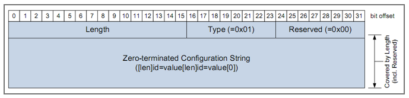
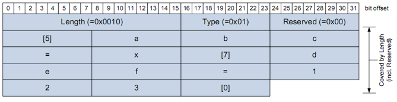
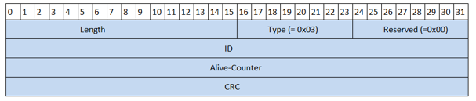
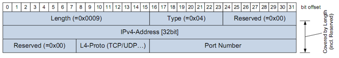
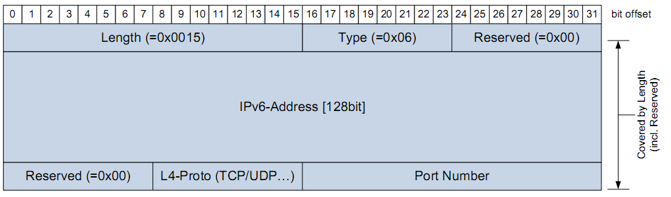

# SOME/IP

(Scalable Service-Oriented MiddlewarE over IP)

[Vector](https://elearning.vector.com/index.php?wbt_ls_kapitel_id=1588443&root=378422&seite=vl_automotive_ethernet_introduction_en)
[Autosar]()
[some-ip.com](http://some-ip.com/papers.shtml)

From Vector 18.09.2017

A new philosophy for data transmission is finding its way into the motor vehicle with SOME/IP (Scalable service-Oriented MiddlewarE over IP). While signal-oriented data transmission is used on classic bus systems (CAN, LIN, FlexRay), SOME/IP allows the introduction of service-oriented transmission of information. However, it must be noted that SOME/IP is not limited to a description of the communication. Rather, it is a middleware that affects the software components of an ECU. For this reason, there is a separate software path in AUTOSAR that allows a connection down to the application.

With signal-oriented data transmission information is sent when the sender sees a need, such as when values are updated or changed, independent of whether these data are currently needed by a receiver in the network. Service-oriented data transmission is different. A sender only sends data when at least one receiver in the network needs this data. The advantage of this procedure is that the network and all connected nodes are not loaded by unnecessary data. Service-oriented data transmission thus requires that a server is informed in one way or another about which receivers are waiting for its data.

A client has the option of subscribing to the content of a service on the server. If an event occurs, it receives the updated data from the server. The SOME/IP Service Discovery (SOME/IP-SD) is used for subscribing to content. A client that wants to subscribe to content on the server sends a Subscribe Eventgroup to the server. If it is possible to subscribe to content, the server responds by sending a positive acknowledgment back to the client. The subscription is now active. If content is not available, the server can decline the subscription by sending a negative acknowledgment.

Multiple clients can subscribe to content of a service simultaneously. The method used to send available data to clients depends on whether the content of a service is made available via UDP or TCP. With UDP, when an event occurs the server can send data to all clients with an active subscription via Unicast, Multicast, or Broadcast. If the content is made available via TCP, a connection to the server must be established by each client, which enables the respective sending of the data.

The contents that are sent by the server, based on an active subscription, can exist in two formats: as an Event Notification and as a Field Notification. Both formats share the common characteristic that their generation is event-driven. The Event Notification corresponds to a form whose fields are filled with properties that represent a snapshot without having any relation to earlier events. The Field Notification, on the other hand, contains values that are related to earlier contents and therefore have a history. For this reason, a field can be expanded to include getter and setter methods that enable reading and writing of the desired contents by a client. A client can thus access contents of the server with read-only or read/write access even without a subscription.

Another data exchange option exists in that information can be made available by the call of a method. A client performs a so-called remote procedure call (RPC), which triggers the start of a function on the contacted server. The function is called using a request that the client sends over the network. This request of the client can also contain data that are transferred to the calling method as parameters. After the function is executed on the server, a return value can be output that is sent by the server to the client using a response. The fact that the client called the function implies that the client wants to make use of the resulting data. But it is also possible that the client calls a method on the server that has no return value. In this case, the process is already complete on the part of the client when the method is actually called.

So that a client knows which services are currently available, SOME/IP-SD provides two mechanisms that allow the dynamic discovery of services. An Offer Service enables the server to provide the network with all its offered services. The Find Service allows clients to request available services instead.

uni-directional RPC communication
bi-directial RPC communication
field communication
messages of different lenghts
defines the endiannes of the header payload
  SOME/IP Header shall be encoded in network byte order (big endian)
  The order inside the payload (parameters) shall be defined by config.

*`BOM`* For strings the BOM is a mark which is added at the start, it stands For
*Byte Order Mark* has to be included in dynamic and fixed length strings. This
field allows to detect the encoding being used.

RPC : Remote procedure call

Fields for the SOME/IP message:
 * Message ID [32 bit]
    - Similar to a CAN ID
    - Consists of two fields:
      - Service ID [16bit]
      - 0 [1 bit]
      - Method ID [Last 15 bit]

Length [32 bit]
Length field shall contain the length in Byte starting from request ID/Client ID
until the end of SOME/IP message.

Request ID:
Provides a method to differentiate multiple parallel uses of the same method
The request ID shall be unique for a provider-suscriber combination.
- When the server generates a response message, the provider shall copy the
  request ID to the response message.
- Request IDs must not be reused until the response is arrived or is not expected
  to arrive anymore.

The Request ID is constructed in the following way:

| client ID | Session ID |
| :------------- | :------------- |
| 16 bits | 16 bits |

Protocol version: 8 bit.

Interface Version:

Message Type 8 bit:

| id | value | Description |
| :------------- | :------------- | :------------- |
| `0x00` | REQUEST | The request expects a response, even if void |
| `0x01` | REQUEST_NO_RETURN | Fire and forget |
| `0x02` | Notification | Request of a notification/event callback expecting no response |
| `0x80` | RESPONSE | The actual response to the request |
| `0x81` | ERROR | response which contains an error |
| `0x20` | TP_REQUEST | TP request expecting a response, even if void |
| `0x21` | TP_REQUEST_NO_RETURN | TP fire and forget |
| `0x22` | TP_NOTIFICATION | TP request of a notification expecting no response |
| `0x23` | TP_RESPONSE | TP response message |
| `0x24` | TP_ERROR | TP response containig an error |

## payload

The siye of the SOME/IP depends on the transport protocol used. With UDP the
SOME/IP payload shall be between [0-1400] bytes. The limitation to 1400 is
needed in order to allow for future changes to protocol.

For TCP supports segmentation payloads, larger sizes are automatically supported

### Serialization of data structures.

The interface specification defines the exact position of all data structures in
the PDU (protocol data unit) and HAS to consider the memory alignment. This is
to ensure that the aligned data starts at certain memory addresses. Aligned to
4 bytes.

This alignment shall be realized by inserting padding elemenents, the padding value
is not defined.

Aligment shall always be calculated from start of SOME/IP message.

#### SOME/IP basic data types (primitive data types)

#### Service and eventgroup

Service: Logic agroupation of none or more of the next:
  - methods
  - events
  - fields
  empty services are not allowed.

Eventgroup: Logic agroupation of events and notification events.

### structured  data types:

The length field is optional and describes the number of bytes this struct
occupies for SOME/IP transport. The length can be 8,16 or 32 bits insterted in
front of the struct.

If the length of the struct sent is bigger than the specified, only the length
is interpreted, the rest is skipped. If the length is less than the sum of the
lengths of all struct members and no substitution for the missing data can be
provided locally by the receiver, the deserialization shall be aborted and the
message malformed.

The Serialization shall follow the depth-first traversal of the structured data.

### structured datatypes and arguments with identifier and optional members.

The usage of data Ids allows describing structs and methods with optional
members/arguments. Whether a member/argument is optional or not, is defined
in data definition. The method to check if an optional member/argument is
actually present in the struct or not, has to be determined at runtime and it
depends on the programming language or platform (may be a null pointer)

The data id is unique only to the data structure but not across different
structs or methods. It´s not possible to define only some members of a struct,
 if one has ID all of them must have id.

The lenght of a tag shall be two bytes:
  * reserved `bit 7 of first byte`
  * wire type `bit 6-4 of the first byte`
  * data id `bit 3-0 of the first byte and bit 7-0 of the second byte`

length field is required to skip unknown members/argumets during deserialization

**The length field shall define the size of the data and padding in bytes and
does not include the size of the length field and type field**

### Event, field and eventgroup

eventgroup:Groups events and notifications events of fields inside a service

Events as well as fields are mapped to at least one eventgroup.

#### strings
The supported encoding for strings: `UTF-8, UTF-16BE and UTF-16LE`

there are dynamic and fixed length strings, both start with the **BOM** field
and they have to end with `\0`. This means that a string shall end with (at least)
two 0x00 bytes.

A dynamic length string must have a field of size 8,16,32 bit defined by the
interface specification.

If the length of a fixed length string is greater than expected, the Serialization
shall be aborted and the message shall be treated as malformed.

If the length of a string with fixed length is less than expected, and the string
is correctly terminated with \0, then the string must be accepted.

For strings of dynamic length the size of the length field is 32 bit, (default
  length of field), otherwise this field can be of 8,16 or 32 bit.

For a dynamic string the length of the `length field` is not considered in the
total length value.

#### Arrays (fixed length)

The length of arrays is defined by the data type definition.

If the elemenents of a fixed size array are more than the specified by the length
field, the extra elements must be skipped, if they are less the serialization must
 be aborted.

#### Arrays (dynamic length)
The length of the array is specified by the length field, which is part of the
message, and it does not forms part of the length count.

#### Enumeration

NO enums, the enums are treated as unsigned integers.

#### Bitfield
NO bit fields, they shall be treated as unsigned ints of size 8,16,32

#### Union / Variant

This is a special data type which data type will be transmitted in the payload and
whose type can only be decided during execution. Then becomes necessary to not
only send the data, but also the metadata.

A union shall consist of a length field, type selector and the paylod.

| Purpose | length |
| :------------- | :------------- |
| length field | 32 bits |
| type field | 32 bits |
| data including padding | sizeof(padding) = length - sizeof(data) |
- - -

### 4.2 Specification of SOME/IP protocol

#### UDP Binding

The SOME/IP  protocol shall not restrict the usage of UDP fragmentation.
The header format allows transporting more than one SOME/IP message in a single
UDP packet. The SOME/IP shall identify the end of a message based on the length
field.

#### TCP Binding

when a TCP connection is lost, outstanding requests shall be handled as timeouts.
The client-server shall use a single TCP connection for all methods, events and
notifications for a service instance. When having more than one instance of a
service s TCP connection per service instance is needed.

The client ins responsible of open and reestrablish tje TCP connectio whenever it
fails.
The client is also responsible to close the connection.
The server shall not close the connection.

#### Request/Response communication

Client->Sends request message
Server->Answers the request.

For this the Client has to set the message type in the header to `REQUEST`
And the server to `RESPONSE` or `ERROR`.

#### Fire and forget communication

This is a request without response message.

The client has to set he message type to `REQUEST_NO_RETURN` and return code to
`0x00`.

Fire & forget sall not return an error.

#### Notification Events

Notifications describe a general publish/subscribe - concept.

Server->publishes
Client->Subscribe

The server has to create a SOME/IP message with the next message type set to:
`NOTIFICATION` 0x02.

The notification only sends the updated values, for the subscription mechanisms
the SOME/IP-SD protocol is used.

###### Strategy for sending notitications

* **Cyclic update**
  - Send an updated value in a fixed interval.
* **Update on change**
  - Send as soon as the value chanes.
* **Epsilon change**
  - Send an update when the difference to the last value is greater than a certain epsilon.

##### Fields
A field represents a status and has a valid value.
A field is a combination of `getter` and `setter` and notification event.

The getter of a field shall be a request/response call with an empty payload in the
request message andthe value of the field in the response message.

The setter of a field shall be a requsest/response call, the desired value of the
field has to be in the payload of the request message; and the value that was set
in the payload of the response message.

##### Error Handling

SOME/IP supports two mechanisms:
* Return codes in the reponse message of methods
  - Shall be used to transport application errors and the response data of the provoder.
* Explicit error messages
  - Transport application errors and the response data or generic SOME/IP errors from
  the provider to the caller of a method.

##### Return Code

The return code shall be a UINT8

The error messages are not answered, in any case ie:
- Events/notifications
- fire & forget

### SOME/IP - SD (Service discovery)

* SD messages are always transmitted from port 30490 to port 30490 using UDP.
* An SD implementation is expeted to keep track of own service instances and
service instance it needs from others.
* SD can be Unicast or multicast.
* It's expected to be self-repairing.
  * Crash/restarting services, host and devices.
  * Regularly terminating services and client applications.
* Service discovery always uses service-id : 0xFFFF
* Service discovery always uses Method-id: 0x8100
* Client-ID is always set to 0, since only one SOME/IP-SD instane exists.
* The message type is always 0x02 (notification)

* A client is not allowed to send a finsService to ask for other service instances
still active, but to wait for a proper offer to arrive.

** SOME/IP-SD == SOME/IP service discovery **
This service discovery is used to:
- Find services
- Test if an instance of a service is running
- publish/subscribe to a service.

#### Entries
There are two types of entries:
1. Service entry

Type:
  1. `0x00` Find service
  2. `0x01` offer service
  3. `0x02` request servive
  4. `0x03` Request Service ACK

Index options: index of the option in array
Number of options: Describes the number of options
Service-ID the id of the service
Instance-ID: ID of the instanve or `0xffff` when there's no specific instance.
Major Version: Describes the version of the interface of the service.
TTL: Time to live of the entry
Minor version: The minor version of the service.

2. eventgroup entry

Type:
1. `0x04` find Eventgroup
2. `0x05` publish event group
3. `0x06` subscribe event group
4. `0x07` subscribeACK

* Index options: Index of the option in the array
* Number of options: describe the number of options
* Service ID
* Instance-ID: The Id of an specific instance or `0xffff` if any instance is valid.
* Major version: Describes the major version of the interface
* TTL: time to live of the entry.
* Eventgroup-ID: The id of the eventgroup to which this enrty is directed.

### Options format
Nearly all entries need a set of parameters to make sense of the incoming data.
Those options are called `Endpoint options`.
  * Unicast UDP or TCP
    * Indicates from where (IP and port) an unicast event or field will be sent.Method invocations also aimed to this destination.

  * Multicast: Only UDP (TCP does not supports multicast)
    * To which IP and port will the server send its multicast and fields.

Options are used to transmit, add  information to an entry.

Each option has:
* Length field: Length of the option in bytes, with counting the Length and type field.
* Type field.

##### Optionsarten (Types of options)

###### 1. Configuration option

* Length in bytes w/o including the length field.
* Type: `0x01`
* Reserved: `0x00`
* Zero terminated Configuration string.

It's a pair of parameters/value string.
In the format of variable length strings, ie, the length of the string must be specified. See example below.

###### 2. load balancing option

This option is used to change the priority in a service/client instance.
Format:
1. Type: `0x02`
2. Reserved: `0x00`
3. priority:
4. Weight:  The weight for this instance. The higher the number, the higher the probability.

###### 3. protection option

Format:
1. Type `0x03`
2. Alive counter:
3. ID: Id of the crc
4. CRC: The CRC for this message.

###### 4. IPv4 Endpoint option

This option message conveys the information needed to stablish a connection
ie, the ip-address, protcol, port.

Format:
* length: 0x0009
* type: 0x04
* reserved: 0x00
* IPv4 Address
* L4 protocol:
  - TCP: 0x06
  - UDP: 0x11
* Port number.

###### 5. IPv6 endpoint option

The same as IPv4 but with extra space to transmit the longer IPv6-address.
###### 6. IPv4 Multicast option

1. Length: 0x0009
2. Type: 0x14
3. Reserved: 0x00
4. IPv4-Address: The address of the Multicast
5. Reserved 0x00
6. L4-Protocol: 0x11 UDP
7. Port number for the Multicast.

###### 7. IPv6 Multicast option

1. Length: 0x0015
2. Type: 0x16
3. Reserved: 0x00
4. IPv6-address The address for the Multicast
5. Reserved 0x00
6. L4-protocol: 0x11 UDP
7. Port number: the port for the Multicast.

#### Offer service entry
#### Subscribe eventgroup entry
#### Subscribe eventgroup ack
#### Stop Subscribe eventgroup entry
#### Find service entry
#### Stop Offer servive entry
#### Subscribe eventgroup NACK

### Unicast Message:

The next messages are sent only using Unicast:
1. SubscribeEventgroup
2. SubscribeEventgroupAck
3. SubscribeEventgroupNack
4. StopSubscribeEventgroup

Startup consists of 3 phases:

1. Initial wait phase:
  1. When the ECU starts, then the Initial wait phase begins.
  2. The ECU starts an initial delay, then the offer and find entries are sent.
2. Repetition phase:
  1. ...
3. Main Phase:
  1.
