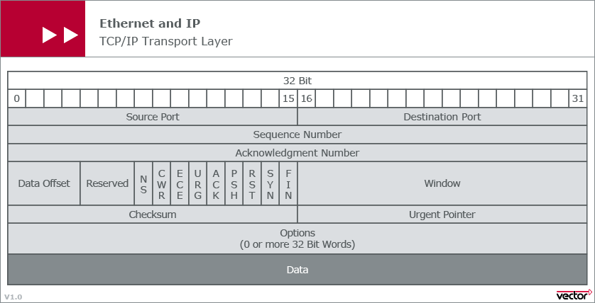
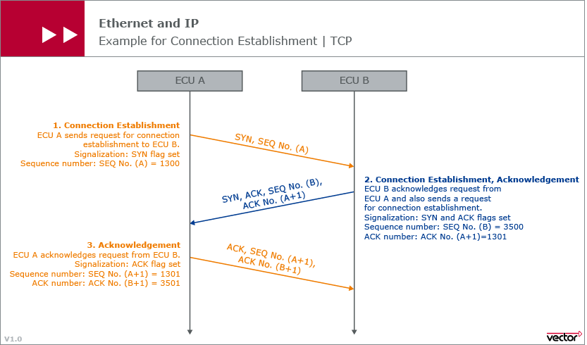

# TCP and UDP
[src vector](https://elearning.vector.com/vl_automotive_ethernet_introduction_en.html)
- This two protocols are layer-4.
- Both protocols divide the data that is to be transmitted into smaller parts.
- This divide-up data is called segments in TCP and datagrams in UDP.

## TCP
This protocol represents a connection-oriented transmission. (close loop)
TCP handles segments.

As this protocol is connection oriented, this means that two nodes must establish
an explicit connection before the actual data transmission. This two nodes are
each identified using an IP address and a port number.

A 3-way handshake is needed.

Because TCP always requires an explicit connection between two nodes, the sending of Broadcast or Multicast messages to the network without a specific receiver is not possible.

## [Sequence-acknowledgment-numbers](http://packetlife.net/blog/2010/jun/7/understanding-tcp-sequence-acknowledgment-numbers/)

- - -

## UDP
This protocol is a connectionless transmission. (open loop)
UDP hadles datagrams.

In contrast to TCP, there are no mechanisms available that can ensure guaranteed
data transmission. The sender is not informed about the loss or interference of
a datagram. Can be easily implemented in protocols on higher layers, if required.

UDP transmission is faster as the sender does not have to wait for response from
the receiver.

UDP has the ability to send datagrams as multicast or broadcast. This means to
send messages to several nodes or all the nodes in the network.

Broadcast

## TCP vs UDP
