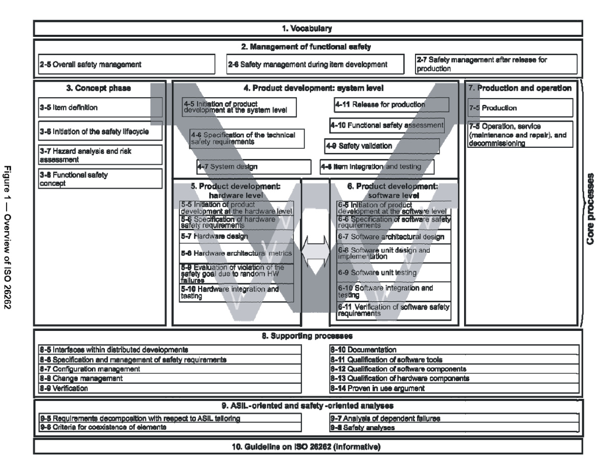

# Automotive Safety Integrity Level (ASIL)
[src](http://www.automotive-spin.it/uploads/8/8W_favaro.pdf)
[Mimg src](https://automotivetechis.wordpress.com/iso-26262/)
Risk classification scheme defined by the ISO 26262, which is an adaptation
of the safety Integrity level in IEC 61508. The ASIL is established by
performing a risk analysis of a potential hazard by looking at the severity,
exposure and controlability of the vehicle operating scenario.

There are four ASIL levels identified:

## ASIL A
The lowest integrity level.
## ASIL B
## ASIL C
## ASIL D
This level dictates the highest integrity requirements on the product.
A failure in a ASIL D system represents likely potential for severely life
threatening or fatal injury in the event of malfunction.

## QM
This level represents application with no automotive hazards and therefore no
safety requirements.

- ASIL level has impact on HW, SW and supporting process
- A hardware element can be designed to satisfy up to ASIL
- An ASIL level

### ASIL decomposition:
ASIL decomposition is a process to fragment the system in sub-systems and then
classify them into different ASIL levels depending on its functionality.

This decomposition can be applied only if the independence criteria is satisfied.
This includes SW & HW dependencies.

There are several issues:
* What about sharing of software resources like OS?
* Sharing firmware?
* Sharing HW resources like memory, AUL...?

Hardware level ASIL decomposition involves deep knowledge of the characteristics
of the available hardware, so that independence, functionality, and cost are all
correctly balanced.

### Alternative decomposition

When only some functions are ASIL D, but there are other functions which are not
safety related in the same system.

The first alternate decomposition represent having two essentially equivalent
processsors with redundant functionality.

